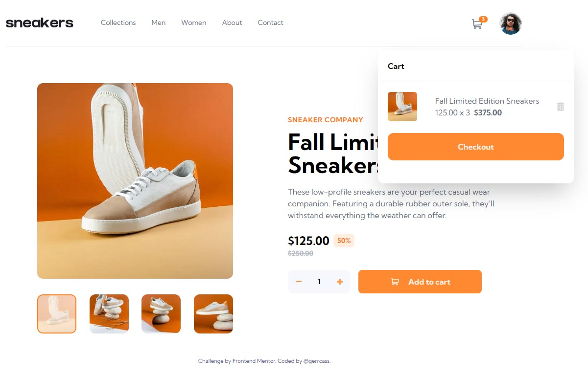

# Frontend Mentor - E-commerce product page solution

This is a solution to the [E-commerce product page challenge on Frontend Mentor](https://www.frontendmentor.io/challenges/ecommerce-product-page-UPsZ9MJp6). Frontend Mentor challenges help you improve your coding skills by building realistic projects.

## Table of contents

- [Overview](#overview)
  - [The challenge](#the-challenge)
  - [Screenshot](#screenshot)
  - [Links](#links)
- [My process](#my-process)
  - [Built with](#built-with)
  - [What I learned](#what-i-learned)
  - [Continued development](#continued-development)
  - [Useful resources](#useful-resources)
- [Author](#author)

## Overview

### The challenge

Users should be able to:

- View the optimal layout for the site depending on their device's screen size
- See hover states for all interactive elements on the page
- Open a lightbox gallery by clicking on the large product image
- Switch the large product image by clicking on the small thumbnail images
- Add items to the cart
- View the cart and remove items from it

### Screenshot

### Links

- Solution URL: [GitHub repo](https://github.com/gerrcass/ecommerce-product-page)
- Live Site URL: [My solution deployed on Vercel](https://ecommerce-product-page.gerardocastillo.me/)

## My process

### Built with

- [Next.js](https://nextjs.org/) - React framework
- [Tailwind Css](https://tailwindcss.com/) - A utility-first CSS framework
- React Component Composition
- Semantic HTML5 markup
- Responsive Design

### What I learned

I wanted a project that looks very visually appealing while also giving me the opportunity to practice my component compositing skills in React. In this project I focus on trying to make the image gallery component reusable, since it is also rendered in a modal and also has a different look in the mobile version. I think that some props drilling isn't a big deal, that is why I didn't implement `React.createContext` or something like that in this project.

I learned a lot about handling media queries, initially I tried to handle all of them from CSS only, but then I realized that it may be necessary to handle them from JavaScript as well via the window.matchMedia API.

### Continued development

I have always thought that what is feasible to do with CSS instead of Javascript should be considered first. In this project I didn't want to focus so much on handling Media Queries from React (ie. window.matchMedia) but rather trying to take advantage of CSS for responsive design.

Looking forward to the future I hope to start new projects where it may be necessary to use both mechanisms or implement a better design pattern.

### Useful resources

- [Using window.matchMedia in React](https://betterprogramming.pub/using-window-matchmedia-in-react-8116eada2588) - This article helped me understand that checking screen size using JavaScript can be a useful tool to complement CSS.
- [React Render Props](https://reactjs.org/docs/render-props.html) - Really nice technique, I used it in `<Lightbox />` along with `React.cloneElement` to inject an additional property as a child component.

## Author

- Website - [Gerardo Castillo](https://gerardocastillo.me/)
- Frontend Mentor - [@gerrcass](https://www.frontendmentor.io/profile/gerrcass)
- LinkedIn - [@gerrcass](https://www.linkedin.com/in/gerrcass/)
